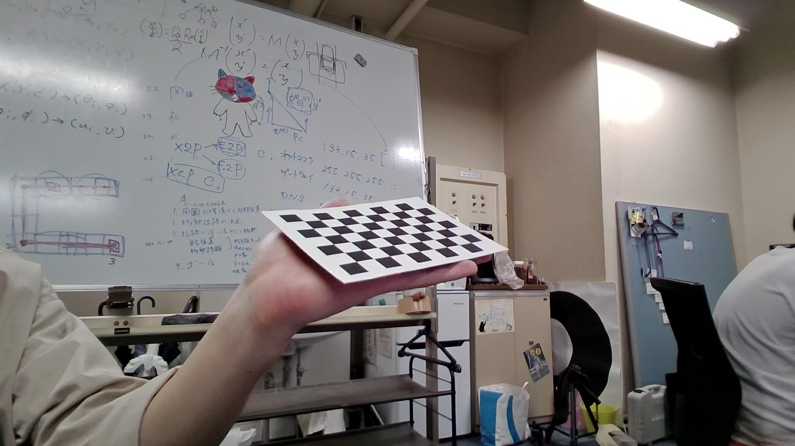
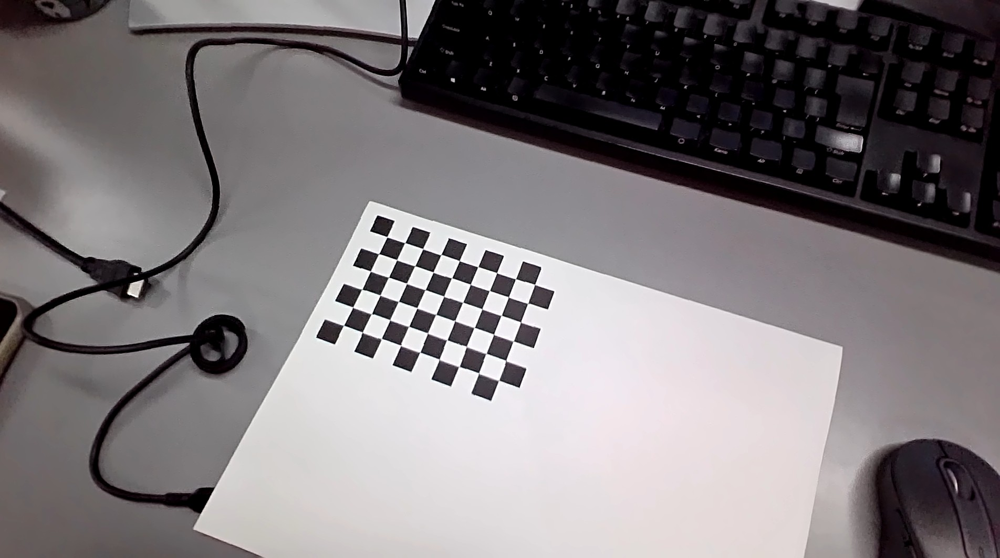
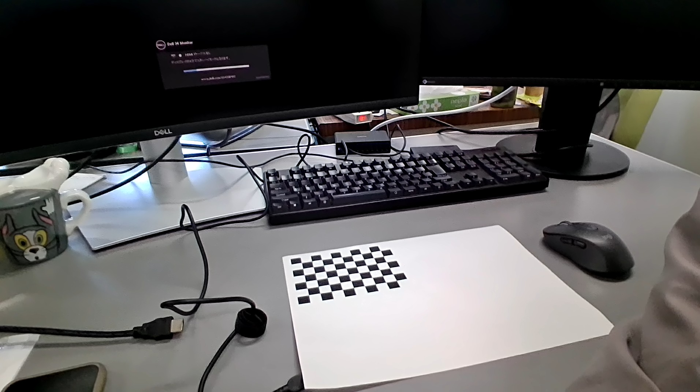
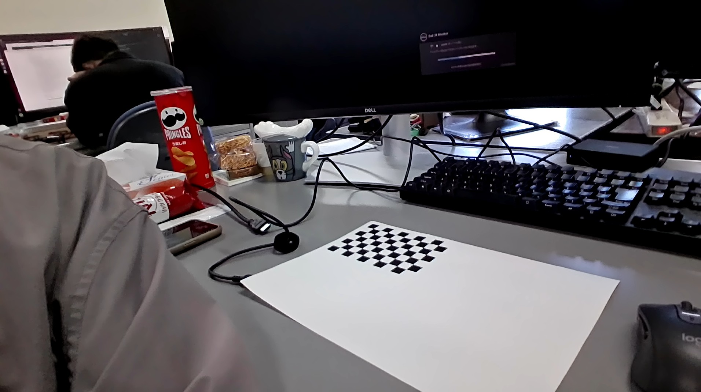

# カメラキャリブレーション（Python：OpenCV）

このツールは、PythonのOpenCVを用いてカメラキャリブレーションを行うツールです。  
キャリブレーションには以下のようなチェスボードを使用します。


## 環境
- Windows 11
- Python 3.11.9
- NumPy 2.3.1
- OpenCV 4.11.0.86

## 概要
このツールで実現できることは以下の4つです。
- カメラキャリブレーション（内部パラメータの計算）
- カメラ姿勢推定（外部パラメータの推定）
- キャリブレーション結果の保存（.datファイル）
- 座標軸の描画
  
## 使用方法
### 1. キャリブレーション画像を用意
以下のようなキャリブレーションパターンの画像を10枚から20枚程度、用意します。  
正確なキャリブレーションを行うためには、様々な角度や距離からパターンを撮影することが推奨されます。

<p float="left">
  
  
  
</p>

### 2. 実行
実行時、以下のようなオプションを設定します。**太字**は必須オプションです。

#### 2.1 オプション一覧
| オプション（どちらでも良い） | 説明 |
| :--- | :--- |
| **-c, --cols** | **チェスボードの列数**（交点の数） |
| **-r, --rows** | **チェスボードの行数**（交点の数） |
| **-s, --square_size** | **マスの1辺の実際の長さ**（cm） |
| **-i, --image_dir** | **キャリブレーション画像のフォルダパス** |
| **-o, --save_dat_dir** | **キャリブレーション結果（.datファイル）を保存するフォルダパス** |
| --length | 描画する座標軸の長さ（cm）|
| --thickness | 描画する座標軸の太さ |

[1.キャリブレーションパターンを用意](#1-キャリブレーションパターンを用意)で紹介したチェスボードは、白マスと黒マス合わせて10×7であるため、`-cols 9 -rows 6`となります。


#### 2.2 実行例
以下のように実行して、カメラキャリブレーションを行います。
```bash
python3 CameraCalibrator.py --cols 9 --rows 6 --square_size 1.27 --image_dir ./calib_images --save_dat_dir ./calibation_results
```
※省略オプションver
```bash
python3 CameraCalibrator.py -c 9 -r 6 -s 1.27 -i ./calib_images -o ./calibation_results
```

#### 2.3 インスタンス化
このツールはクラス設計されており、以下のように**インスタンス化して使用**することもできます。

```python
# 以下、CameraCalibrator.pyと同じ階層で実行する場合
import CameraCalibrator

# 1. インスタンス生成
calibrator = CameraCalibrator(
    cols=9,
    rows=6,
    square_size=1.27,
    image_dir="./calib_images",
)

# 2. キャリブレーション実行
calibrator.calibrate()
print("カメラ内部パラメータ:\n", calibrator.camera_matrix)
print("歪み係数:\n", calibrator.dist_coeffs)

# 3. 姿勢推定
img = cv2.imread("./input.jpg")
calibrator.estimate_pose(img)
print("回転ベクトル (rvec):\n", calibrator.rvec)
print("並進ベクトル (tvec):\n", calibrator.tvec)
print("回転行列 (R):\n", calibrator.R)

# 4. キャリブレーション結果を.datファイルに保存
calibrator.save_dat("./calibration_results")

# 5. 座標軸描画（estimate_pose()で使用した画像に描画）
ret, img = calibrator.draw_axis()
if ret:
    cv2.imshow("Axis", img)
    cv2.waitKey(0)
```

## 備考
### `.dat`の活用方法
`R.dat`, `t.dat`, `K.dat`は📦[世界座標系の軸の描画ツール](https://github.com/okamoto-fumiya/draw_world_axis)で使用できます。
